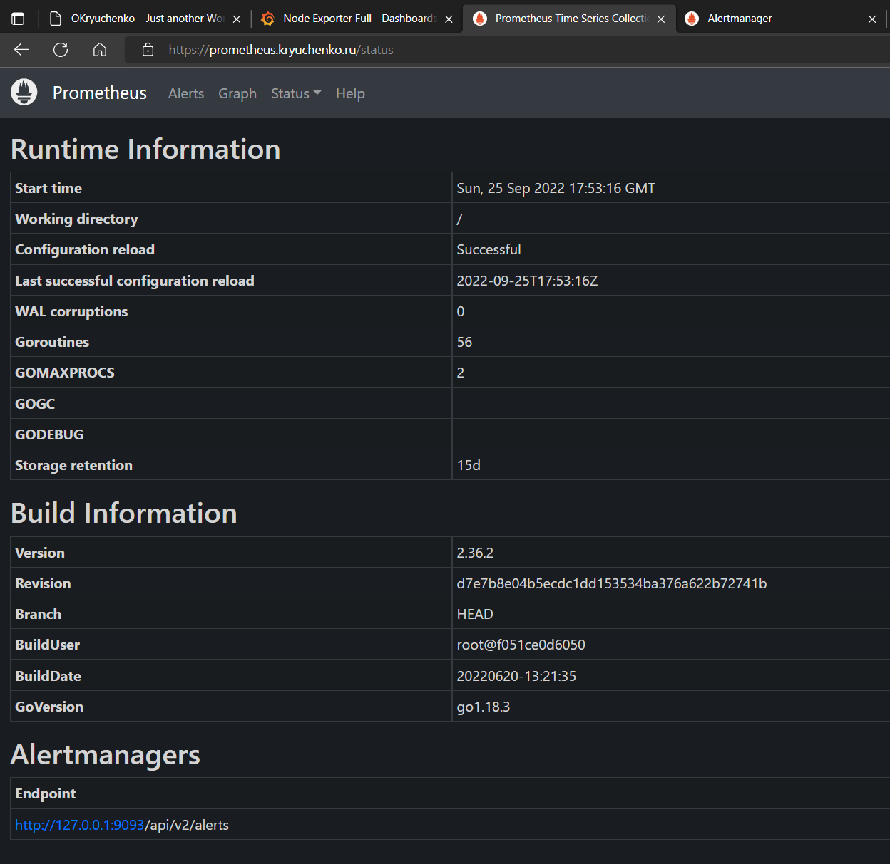
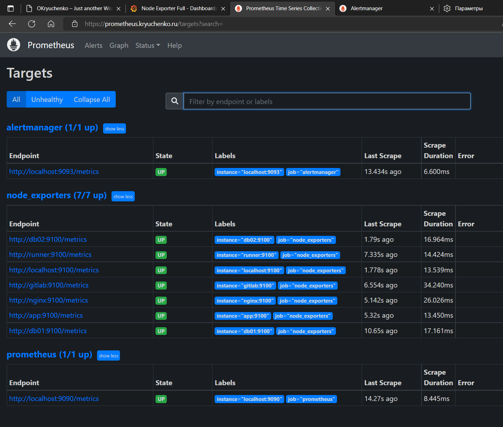

# Дипломный практикум в YandexCloud
  * [Цели:](#цели)
  * [Этапы выполнения:](#этапы-выполнения)
      * [Регистрация доменного имени](#регистрация-доменного-имени)
      * [Создание инфраструктуры](#создание-инфраструктуры)
          * [Установка Nginx и LetsEncrypt](#установка-nginx)
          * [Установка кластера MySQL](#установка-mysql)
          * [Установка WordPress](#установка-wordpress)
          * [Установка Gitlab CE, Gitlab Runner и настройка CI/CD](#установка-gitlab)
          * [Установка Prometheus, Alert Manager, Node Exporter и Grafana](#установка-prometheus)
  * [Что необходимо для сдачи задания?](#что-необходимо-для-сдачи-задания)
  * [Как правильно задавать вопросы дипломному руководителю?](#как-правильно-задавать-вопросы-дипломному-руководителю)
---

* [Подробное описание дипломного задания](README-diplom-task.md)
---

## Состав проекта
>tree devops-diplom-yandexcloud -d -L 1
```
devops-diplom-yandexcloud
├── ansible 
├── gitlab
├── packer
├── screenshots
├── terraform
└── vagrant
```

### Подготовительная часть
Для работы с дипломным проектом подготовил виртуальную машину через vagrant.
Установил YC, Terraform и Ansible  

```shell
# -*- mode: ruby -*-
ISO = "bento/ubuntu-20.04"
NET = "192.168.1."
DOMAIN = ".natology"
HOST_PREFIX = "diplom-yc"
INVENTORY_PATH = "../ansible/inventory"
servers = [
  {
    :hostname => HOST_PREFIX + "01" + DOMAIN,
    :ip => NET + "18",
    :http_host => "8080",
    :http_vm => "8080",
    :ram => 2048,
    :core => 2
      }
]
Vagrant.configure(2) do |config|
  config.vm.synced_folder "../../..", "/vagrant", disabled: false
  servers.each do |machine|
    config.vm.define machine[:hostname] do |node|
      node.vm.box = ISO
      node.vm.hostname = machine[:hostname]
      node.vm.network "private_network", ip: machine[:ip]
      node.vm.network :forwarded_port, guest: machine[:http_vm], host: machine[:http_host]
      node.vm.network :forwarded_port, guest: machine[:postgres_port], host: machine[:postgres_port]
      node.vm.provider "virtualbox" do |vb|
        vb.customize ["modifyvm", :id, "--memory", machine[:ram]]
        vb.customize ["modifyvm", :id, "--cpus", machine[:core]]
        vb.name = machine[:hostname]
#   *** update ***
        config.vm.provision :shell, :inline => "sudo apt-get update --fix-missing"
# #   *** install YC  ***
       config.vm.provision :shell, :inline => 'curl https://storage.yandexcloud.net/yandexcloud-yc/install.sh | bash -s -- -i /opt/yandex-cloud -a'
#   *** install terraform ***
        config.vm.provision :shell, :inline => 'curl -fsSL https://apt.releases.hashicorp.com/gpg | sudo apt-key add -'
        config.vm.provision :shell, :inline => 'sudo apt-add-repository "deb [arch=amd64] https://apt.releases.hashicorp.com $(lsb_release -cs) main"'
        config.vm.provision :shell, :inline => 'sudo apt-get update && sudo apt-get install terraform'
#   *** install Ansible    ***
        config.vm.provision :shell, :inline => 'curl https://bootstrap.pypa.io/get-pip.py -o get-pip.py'
        config.vm.provision :shell, :inline => 'python3 get-pip.py'
        config.vm.provision :shell, :inline => 'python3 -m pip install ansible'

      end
     end
  end
end
```

### Готовим образ Centos 7 для использования в дипломном проекте
Устанавливаем Packer на ubuntu
```shell
curl -fsSL https://apt.releases.hashicorp.com/gpg | sudo apt-key add -   
sudo apt-add-repository "deb [arch=amd64] https://apt.releases.hashicorp.com $(lsb_release -cs) main"
sudo apt-get update && sudo apt-get install packer
```
Инициализируем Yandex Cloud
```shell
yc init
```

Создаём сеть
```shell
yc vpc network create --name net --labels my-label=netology --description "my network for packer"
```
Cоздаём подсети
```shell
yc vpc subnet create --name my-subnet-a --zone ru-central1-a --range 10.1.2.0/24 --network-name net --description "my first subnet via yc"
```
Проверяем валидность и начинаем сборку образа
```shell
packer validate centos-7-base.json
packer build centos-7-base.json
```
Список образов
```shell
yc compute image list
```
id образа будет использоваться для terraform в файле variables.tf


Cобрали образ, удалили сеть и подсеть
```shell
yc vpc subnet delete --name my-subnet-a && yc vpc network delete --name net
```


##Процесс выполнения 

выполнить экспорт переменных окружения:
```shell
export TF_VAR_cloud_id="b1gi170919i7bg9r7" #  токен Yandex Cloud (данные изменены)
export TF_VAR_folder_id="b1ggf7pops82f81r" # id облака 
export ANSIBLE_HOST_KEY_CHECKING=False 
```

переходим в папку terraform   
создаем workspace

```shell
terraform workspace new stage
terraform workspace new prod
terraform workspace select stage
````
инициализируем бакет
```shell
terraform init -backend-config=backend.conf
```
содержимое backend.conf

```shell
    endpoint   = "storage.yandexcloud.net"
    bucket     = "netology-backet2"
    region     = "ru-central1-a"
    key        = "./terraform.tfstate"
    access_key = "YCAJETS72hXdfgfdUAq6mTF0V" # данные изменены
    secret_key = "YCPnYgKZetertyWLMXitRXWIJzllsw2UgQu2" # данные изменены

    skip_region_validation      = true
    skip_credentials_validation = true

```

### Подготовка роли Ansible
Создаем новую роль   
`ansible-galaxy role init install-gitlab`

После редактирования роли отправляем ее в github, чтобы была возможность скачать ее при необходимости

При помощи `ansible-galaxy` скачать себе эту роль. 
Предварительно ssh ключи добавить в github
```shell
ansible-galaxy install -r requirements.yml -p roles -f
```

Содержимое файла requirements.yml (В данном примере только одна роль, не стал для всех используемых ролей делать отдельные репозитории)

```shell
---
 - name: install-gitlab
   src: git@github.com:OKryuchenko/install-gitlab.git
   scm: git
```
## Создание инфраструктуры
```
terraform/
├── ansible.tf          # запуск плейбуков Ansible
├── backend.conf        # конфигурация бекенда YC
├── dns.tf              # конфигурация DNS
├── gitlab.tf           # запуск скриптов gitlab
├── group_vars.tf       # Terraform собирает переменные, отправляет в Ansible ../ansible/group_vars/all.yml
├── inventory.tf        # Terraform подготоавливает файл инвентори для Ansible ../ansible/inventory/stage.yml
├── key.json            # Ключ сервисного аккаунта YC. Скрыт в .gitignore
├── network.tf          # Настройки сетей
├── output.tf           # Выходные данные
├── providers.tf        # Настройки провайдеров
├── variables.tf        # Переменные. Для выдачи тестовых сертификатов значение переменной acme_server - etsencrypttest, для рабочих - etsencrypt
└── vm.tf               # Настройки виртуальных машин
```
###Запуск Terraform
```shell
terraform plan
terraform apply --auto-approve
```
###Результат выполнения


список ВМ

cloud dns


WordPress   
   
При коммите в репозиторий с WordPress и создании тега (например, v1.0) происходит деплой на виртуальную машину
   


Gitlab


Grafana

Prometheus



Alertmanager

###Удаляем инфраструктуру 
Удаление отдельного ресурса
```shell
terraform destroy --target yandex_compute_instance.wordpress
```
Удаление инфраструктуры полностью
```shell
terraform destroy --auto-approve
```


удаляем виртуальную машину vagrant
```shell
vagrant destroy
```


 
 